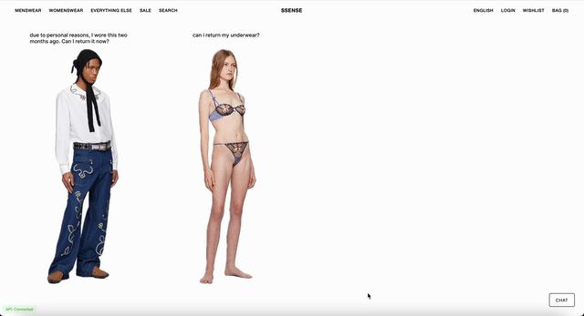

# SSENSE Return Policy Chatbot - Neuro-Symbolic PoC

I extracted and translated SSENSE’s return policy into structured logical rules. This Natural Language to Logical Rules pipelines is still a work in progress. I then used this as a Prolog knowledge base to enable precise and automated **reasoning** about returns. It combines neural and symbolic methods to **accurately** answer customer questions. 

<h3>Demo</h3>
<div align="center">
  
</div>

## Relation with past works

Previously, I built an AI chatbot for a real client, CentreDMV, as part of a final group project at school (GitHub repo). That chatbot utilized GPT-4 through OpenAI's API, and we reduced hallucinations by fine-tuning tool usage. However, it was not as robust or accurate as this neuro-symbolic AI approach.

Furthermore, this neuro-symbolic architecture offers **explainability**. Unlike purely neural approaches where the reasoning can be a black box, this project highlights the symbolic component (Prolog) for core policy logic. I added an **"Explanation" feature** by displaying a user-friendly description of the policy rule or check made by the Prolog knowledge base to arrive at the answer. I believe this to be better not only for user trust but also for development and future improvements. Seeing *why* the bot gave an answer makes it much easier to debug the logic, refine the knowledge base rules, or improve the NLU's predicate selection.

## Key Features

* **Frontend :** Simple HTML/CSS/JavaScript frontend for user interaction.
* **Natural Language Understanding (NLU):** OpenAI GPT-4o to parses the user's questions and extract relevant entities (item type, region, days since delivery, etc).
* **Symbolic Knowledge Base:** Prolog file (`ssense_policy.pl`) containing structured rules and facts derived from the SSENSE return policy.
* **Logical Reasoning:** Executes Prolog queries against the knowledge base based on the NLU output to determine policy details.
* **Natural Language Generation (NLG):** OpenAI GPT-4o to translate the structured Prolog results back into a conversational answer for the user.
* **Clarification Handling:** Asks follow-up questions if information is missing for a query.
* **Off-Topic Detection:** Identifies questions unrelated to the return policy and responds politely without attempting invalid queries.

## Neuro-Symbolic Approach

This project demonstrates a neuro-symbolic architecture:
1.  **Symbolic (Prolog KB):** Provides a **precise** and **verifiable** representation of the SSENSE return policy rules. Answers regarding the policy are grounded in defined logic.
2.  **Integration:** The Flask backend controls the flow:
    * The LLM analyzes the user's query to determine the correct logical `predicate` and `arguments`.
    * The system constructs and executes a query against the Prolog KB using these structured parameters via `Pyswip`.
    * The logical results (success/failure, variable bindings) from Prolog are passed back to the LLM.
    * The LLM generates a final response with the factual information retrieved from the symbolic KB.

This combination leverages the strengths of both paradigms: the LLM's conversational ability and the Prolog KB's logical rigor and factual consistency.

## Setup Instructions

1.  **Clone the Repository:**
    ```bash
    git clone https://github.com/margielamob/ssense-chat.git
    cd ssense-chatbot 
    ```

2.  **Install SWI-Prolog:**
    * Pyswip requires a SWI-Prolog installation. Download from the [official SWI-Prolog website](https://www.swi-prolog.org/download/stable) or use a package manager:
        * **macOS (Homebrew):** `brew install swi-prolog`
    * Ensure the `swipl` command is accessible in your system's PATH.

3.  **Set up Python Environment:**
        ```bash
        python -m venv venv
        # On macOS/Linux:
        source venv/bin/activate
        # On Windows (cmd):
        # venv\Scripts\activate
        ```

4.  **Install Python Dependencies:**
        ```bash
        cd backend
        pip install -r requirements.txt
        ```

5.  **Configure OpenAI API Key:**
    * Edit the `.env` file and replace the placeholder with your actual OpenAI API key:
        ```dotenv
        OPENAI_API_KEY='sk-YourActualOpenAIapiKey...'
        ```
    * **Important:** Ensure the `.env` file is listed in your main `.gitignore` file to avoid accidentally committing your key.

## Running the Application

1.  **Start the Backend Server:**
    * Make sure you are in the `backend` directory and your virtual environment is activated.
    * Run the Flask application:
        ```bash
        python app.py
        ```
    * The server should start, typically on `http://localhost:5001`.

2.  **Open the Frontend:**
    * Navigate to the `frontend` directory using your file explorer.
    * Double-click and open the `index.html` file in your preferred web browser.

## Testing the Chatbot
Don't forget this is just a proof of concept!!